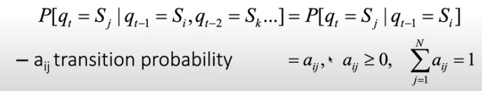
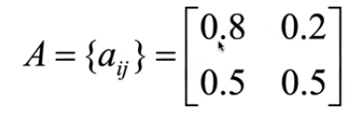
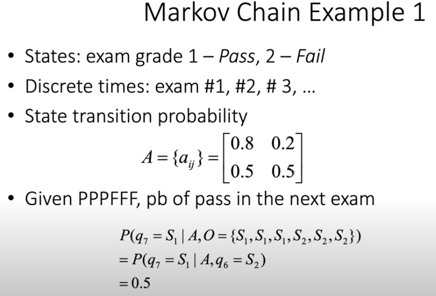
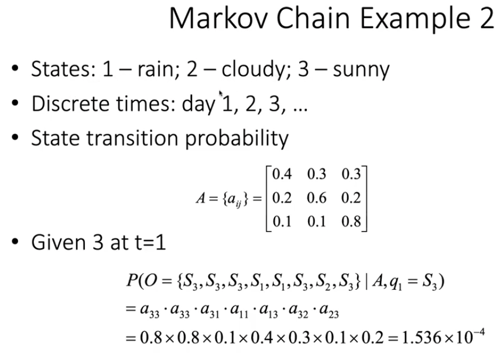
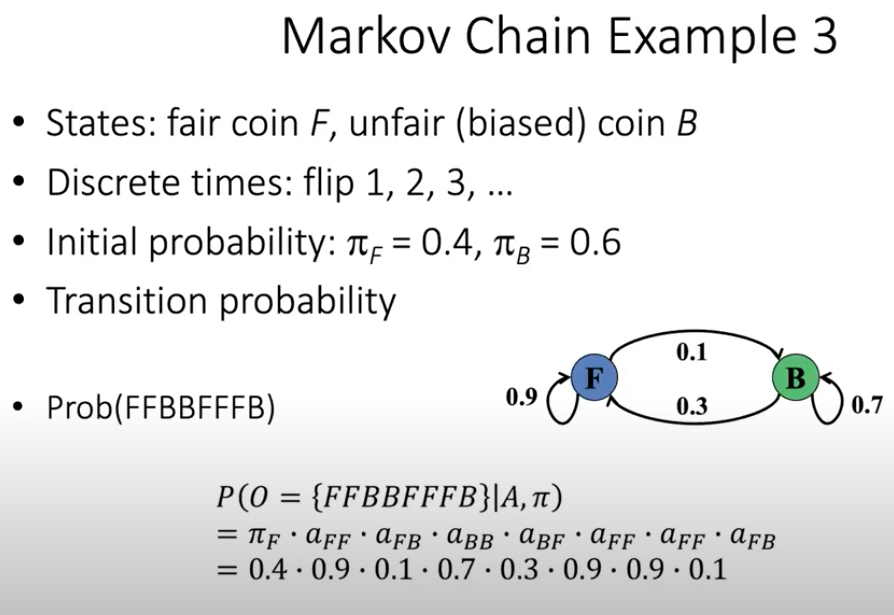

```{r setup, include=FALSE}
knitr::opts_chunk$set(echo = TRUE)
```
```{r, include=FALSE}
image_dir <- "~/git/notes/shirley_liu/img/"
```

# Description

Notes from Shirley Liu's lecture series on [Hidden Markov Models](https://www.youtube.com/watch?v=VBs8FYsZIN4)

* The folder, **`r image_dir`** contains the images from the video that will be embedded in this document

## Lecture 14.1: Markov Chain
* **IDD processes** = independently and identically distributed events 
  * events are not correlated to each other 
  * Current event has no predictive power of future event
  * Example: a coin flip --> P(head | head) = P(head)
  
* **Discrete Markov Process - ** Within the processes are: 
  * Distinct states S: $S_1$ = heads, $S_2$ = tails for a fair coin
  * Regularly spaced distinct times: $t = day 1, day 2, ...$
  * **1st order Markov Chain:** the future state only depends on present state, but not the path to get there --> this is most similar to an **IDD process**
  * **$a_{ij}$ = transition probability**: What is the probability of obtaining $S_j$ when the current state is $S_i$
  
  
* **Markov Chain Example**
  * States: exam grades where 1 - Pass and 2 - Fail
  * Discrete times: exam #1, #2, #3, etc.
  * State transition probabilities: 
    * **Note:** the probability of the two states (P/F) add up to one
    * $S_1$: pass --> P(pass) = 0.8 and P(fail) = 0.2
    * $S_2$: fail --> P(pass) = 0.5 and P(fail) = 0.2
  * Given PPPFFF --> P(pass) the NEXT exam is: 
    * $P(q_7 = S_1 | A, O = {S_1, S_1, S_1, S_2, S_2, S_2})$
    * = $P(q_7 = S_1 | A, q_6 = S_2)$ --> THIS IS A MARKOV CHAIN SO ONLY THE IMMEDIATE STATE BEFORE THE CURRENT STATE MATTERS
    * = 0.5

### {.tabset}
#### Markov Chain Example 1


#### Markov Chain Example 2


#### Markov Chain Example 3

  * **Initial probability $pi_{F/B}$ --> probability of using the fair or biased coin in the first place 
  


## Lecture 14.2: Hidden Markov Model
