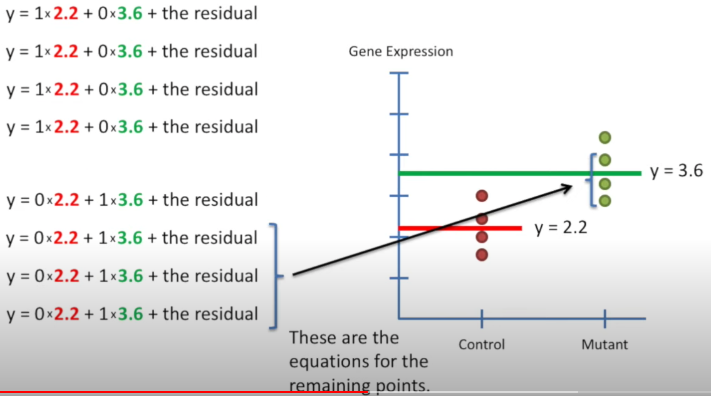
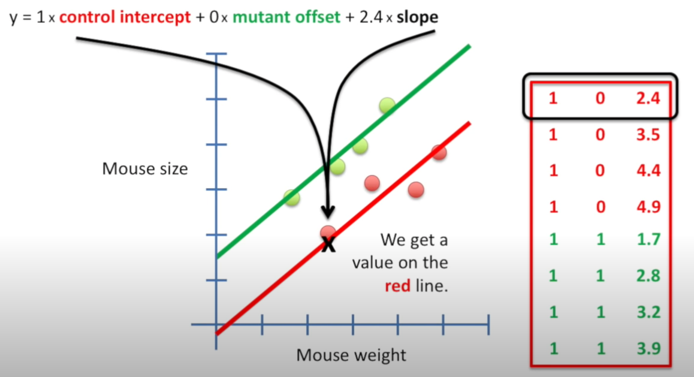

```{r setup, include=FALSE}
knitr::opts_chunk$set(echo=TRUE)
```
```{r include = FALSE}
image_dir <- "~/git/notes/statsquest/img/
"
```


# Description
This document contains notes taken from Josh Starmer's StatsQuest [Youtube channel](https://www.youtube.com/c/joshstarmer/videos?view=0&sort=da&flow=grid). 

* The folder, **`r image_dir`** contains the images from the video that will be embedded in this document. 

## [Linear Regression and Linear Models](https://www.youtube.com/watch?v=PaFPbb66DxQ&list=PLblh5JKOoLUIzaEkCLIUxQFjPIlapw8nU)

### Fitting a line to data AKA least squares AKA linear regression
* Get data points and draw horizontal line around the ***mean*** of the data
* Subtract the value of the horizontal line (y=b) from the y-coordinates of the datapoints: 
  * $total = (b-y1) + (b-y2) + (b-y3) + (b-y4) + (b-y5)$
  
  * **NOTE:** In this example, *y4* and *y5* are greater than *b* --> this will subtract the value from the total --> would make the overall fit appear better than it really is 
  
    * When total = 0 --> the line fits the data points perfectly 
    * When total >>> 0 --> the line does not fit the data points all that well
  
  * Square the values of each difference to ensure each term is positive: $total = (b-y1)^2 + (b-y2)^2 + (b-y3)^2 + (b-y4)^2 + (b-y5)^2$
    * Called the ***sum of squared residuals***
    * The distance between the line and the data point is called a **residual**
    
  * Rotate the line and calculate the *sum of squared residuals* --> use the line that has the lowest value for the best fit
  
* **How to find the line of best fit**
  * $y = a*x + b$ --> find optimal values for *a* and *b* to minimize *sum of squared residuals*
  * *sum of squared residuals* $= ((a*x_1 + b) - y_1)^2 + (a*x_2 + b) - y_2)^2 + ...)$
    * $a*x_1 + b$ --> value of the best fit line at $x_1$
    * $y_1$ --> observed value at $x_1$
  * There is a point when the *sum of squared residuals* is at its lowest depending on the slope of the line
    * Take the derivative of the function that provides the values of *sum of squared residuals* given a slope
    * Look for the slope when the derivative = 0 
    * Different slope and intercept values will alter the *sum of squared residual* values --> see how different slopes/y-intercept values for the line of best fit alter the sum of square residuals values (i.e. define slope and alter y-intercepts points and vice versa)

* **Take Home Points**
  * Goal is to minimize the square of distances b/w the observed values and the line 
  * Take derivative of sum of squared residuals with different slopes --> find where it is equal to 0
  * Final line minimizes sums of squares between the line itself and the real data
  
#### {.tabset}
##### Horizontal Line


##### Line of least squared residuals


##### Finding line of best fit 


### R-squared explained 
* Metric of correlation 
* Variation of the data = $\frac{\sum_{i}(mouse weight_i - mean/line)^2}{n}$
  * Variance is the average sum of squares per sample 
  * See below for example
* **R^2 --> quantifies how much better of *line of best fit* fits the data better than a line on the data's mean**
  * $R^2 = \frac{var(mean) - var(line)}{var(mean)}$
  * **NOTE:** variation around the line should never be greater than variation around the mean
  * $R^2$ quantifies the decrease in variation around the line relative to the total variation around the mean
    * $R^2 = 81%$ --> there is 81% less variation around the line than the mean 
    * The size/weight relationship (see below example) accounts for 81% of the variation 
* **"The statistically significant $R^2$ was 0.9" --> The relationship b/w two variables explains 90% of the variation in the data and something else explains the remaining 10%**

* **How is R^2 related to R?**
  * $R^2$ is the square of R
  * **"The statistically significant R was 0.9" --> The relationship b/w the two variables explains 81% ($0.9 * 0.9$) of the variation in the data...**
  * It is not easy to determine how much better of a correlation b/w variables with just R
    * $R = 0.7$ and $R^2 = 0.5$ --> 50% of the variation is explained
    * $R = 0.5$ and $R^2 = 0.25$ --> 25% of the variation is explained 
    * $R^2$ shows that the first correlation is **twice** as good as the second
  * **NOTE:** $R^2$ does not indicate the direction of the correlation 
  
* **Main Ideas**
1. $R^2$ is the percentage of variation explained by the relationship between two variables
2. Just square R to get $R^2$
  
#### {.tabset}
##### Variation of the data


##### Example with R^2 (positive example)


##### Example with R^2 (negative example)


##### Variance calculation example


### Linear Regression (Pt. 1)
* **Main Ideas:**
  1) Use least-squares to fit a line to the data
  2) Calculate $R^2$
  3) Calculate *p-value* for $R^2$
* Adding another variable/parameter to line of best fit equation will never make *sum of squared residules* around *line of best fit* (SS(fit)) worse than equations with fewer variables/parameters (see below)
  * Adding more parameters to equation --> more opportunities for random events to affect SS(fit) --> change $R^2$
  * Adjusted $R^2$ --> scale $R^2$ by number of parameters
* **How to determine if $R^2$ is significant**
  * p-value derived from $F = \frac{var(explained by mouse weight)}{var(not explained by mouse weight)}$
  * Variation in mouse size explained by weight --> same as reduction in variance when we take weight into account ($R^2$)
  * Variation in mouse size not explained by weight
  * $F = \frac{SS(mean) - SS(fit)/(p_{fit} - p_{mean})}{SS(fit)/(n - p_{fit})}$
    * $p_{fit}$ = number of parameters in the fit line (y = mx + b) --> has 2 parameters: y-intercept and slope 
    * $p_{mean}$ = number of parameters in the mean line (y = b) --> has 1 parameter: y-intercept 
    * $n$ = number of samples
    * Numerator = variance explained by extra parameter (i.e. variance in mouse size explained by mouse weight)
  * In the above examples: 
    * The "fit" line has 1 more parameter than the mean line: slope
    * Slope describes the relationship b/w weight and size 
    * $p_{fit} - p_{mean}$ = 2 - 1 = 1 --> the "fit" has one extra parameter: mouse weight...
  * **Why divide SS(fit) by $n - p_{fit}$ instead of just $n$?????**
    * When more parameters are used in the "fit" equation --> need more data to estimate them 
    * Ex: Only need two points to estimate a line BUT need 3 points to estimate a plane 
  * **How to convert F-statistic into p-value:** (see below)
    * Calculate F-statistic values for a randomly generated dataset
    * Repeat above simulations and plot F-statistic value in a histogram
    * p-value = number of extreme values / total number of values 
    * **NOTE:** p-values will be smaller when there are more samples relative to the number of parameters in the fit equation (recall $(n-p_{fit})$)

* **Main Ideas Revisited:** 
* Linear regression quantifies relationship in the data via $R^2$
* Linear regression determines how reliable that relationship is with the ***p-value calculated from the F-statistic***

#### {.tabset}
##### Add parameters

  
##### Summary of $R^2$


##### F-stat --> p-value 


### Doing Linear Regression in R
#### Results of regression summary: 
* **Residuals:** Summary of residuals (distance from data to fitted line). Should be symmetrically distributed around the line. 
* **Coefficients:** Provides least-square estimates for the fitted line 
  * y-intercept and slope values
  * **Std. Error** and **t-value** show how **p-values** were calculated 
  * p-value tests if the values for y-intercept and slope are equal to 0 --> if so, the variable used does not have much use in the model 
  
* **Residual standard error:** Square root of the denominator in the equation for F.
* **Multiple R-squared:** simply $R^2$ as described above --> weight can explain ##% of variation in the mouse size. 
* **Adjusted R-squared:** $R^2$ scaled by the number of parameters in the model 
* **F-statistic:** provides:
  1) F-statistic value
  2) Degrees of freedom
  3) p-value 
  
```{r}
mouse_data <- data.frame(
  weight = rnorm(n = 100, mean = 10, sd = 1),
  size = rnorm(n=100, mean = 15, sd = 2)
)

## lm stands for linear models 
mouse_regression <- lm(size ~ weight, data = mouse_data)
```
#### {.tabset}
##### Summary of regression data
```{r}
summary(mouse_regression)
```

##### Plot
```{r}
plot(mouse_data)
abline(mouse_regression, col = "blue")
```


### Multiple Regression (Pt. 1.5)
* Simple regression is fitting a **line** (y = mx + b) to the data
* Mutliple regression is fitting a **plane** (y = mx + pz + b) to the data where m and p are slopes
* Calculating $R^2$ is the same for both simple and multiple regression
* **NOTE:** Need to adjust $R^2$ for additional parameters in the "fit" equation
  * $p_{fit} = 3$ for multiple regression with two variables to estimate a third variable
* **Utility in comparing simple regression and multiple regression**
  * Determine if it is necessary to collect a 2nd variable (tail length)
  * use the same F-statistic calculation ***BUT:*** replace "mean stuff" with "simple regression stuff"
    * Calculate sums of squared residuals around the simple regression line 
    * Calculate sums of squared residuals around the multiple regression line
  * $F = \frac{SS(simple) - SS(multiple)/(p_{multiple} - p_{simple})}{SS(multiple)/(n-p_{multiple})}$
  
  * If difference in $R^2$ values is large (and p-value is small) --> it was worth measuring the 3rd variable (i.e. tail length)


### t-tests and ANOVA
* Performing **t-test** is similar to getting *sum of squared residuals* around "mean" and "fitted" line
* **Step 1:** Ignore x-axis and find the overall mean of all data points
* **Step 2:** Calculate SS(mean)
* **Step 3:** Fit a line to the data
  * For control data: $y = 1*2.2 + 0*3.6 + residual$
  * For experimental data: $y = 0*2.2 + 1*3.6 + residual$
  * Isolation of the 1's and 0's forms a ***design matrix*** (see the example) --> combine with abstract version of the equation to represent a "fit" to the data
  * **The role of each column is assumed:** $y = mean_{control} + mean_{mutant}$
* **Step 4:** Calculate SS(fit) --> sum of squared residuals around the fitted lines
* **Step 5:** Plug values into F-statistic calculation as done above --> get p-value for the t-test

* **ANOVA Analysis** --> tests if 2+ groups of data are significantly different 
  * ANOVA requires the same fundamental steps as above 
  * Add more columns to the **design matrix** when calculating the "fit" line


#### {.tabset}
##### Step 1


##### Step 2


##### Step 3


##### Step 3 Example


##### Step 3 Design Matrix


##### Step 4: 


##### t-test review


##### ANOVA review


### Design Matrices
* Used when calculating t-test statistic (see general principal above)
* line of best fit: $y = mean_{control} + difference_{(mutant - control)}$
* **NOTE:** 
  * "control" and "mutant" measurements turn on $mean_{control}$
  * Only "mutant" measurements turn on $difference_{mutant - control}$
* Design matrix does not have to be 0's and 1's (see below)

* ***Combine t-test and regression***
  * Describe relationship b/w *mouse weight* and *mouse size*
  * But we now have 2 different types of mice (red - ctr and green - mut)
  * Mut mice and ctr mice follow different trends --> are these significantly different? 
  * t-test alone: ignores relationship b/w weight and size
  * linear regression alone: ignores difference between the two groups in size
  * normal t-test compares means --> "regression" t-test compares lines of best fits b/w two groups 
    * $y = (control-y-intercept) + (mutant-offset) + (slope)$
    * Design matrix column values: 
      * col1 = all 1 --> indicates both lines intercept y-axis at some point
      * col2 = mutation samples = 1, others = 0
      * col3 = weight data (i.e. x variable input)
    * **SS(fancy)** = Calculate *sum of squared residuals* for each data point around its respective line
    * **SS(simple)** = sum of squared residuals around the aggregate mean/aggregrate regression line (across all mouse groups)
    * Calculate F-statistic --> p-value
  
#### {.tabset}
##### Summary Slide


##### Design matrix non- 0/1


##### Combine t-test and regression


##### Calculate sum of squared residuals (SS(fancy))


##### Calculate F-statistic


##### Example to account for batch effect
* Essentially add a normalizing parameter that adjusts the data for the batch effect
* Then perform similar analysis as above to determine significant differences b/w 2 groups across all replicates


